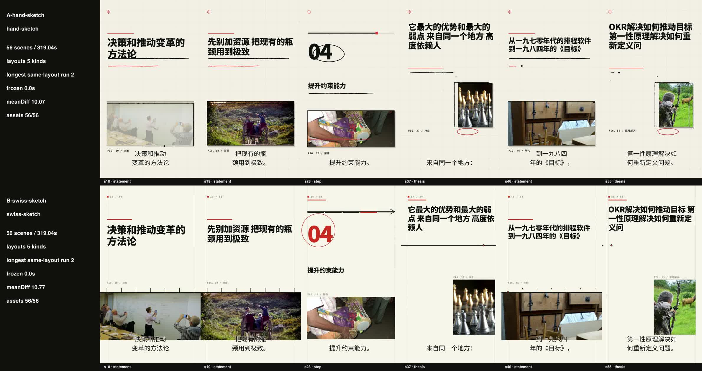
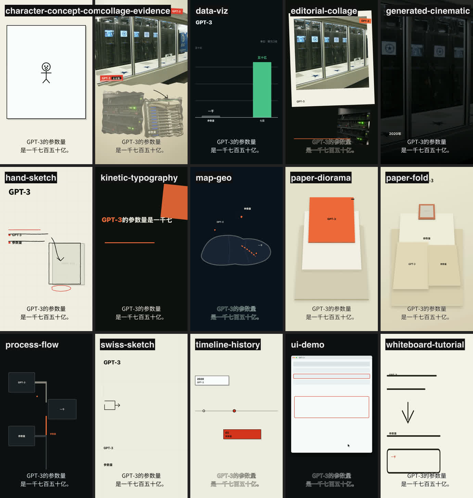
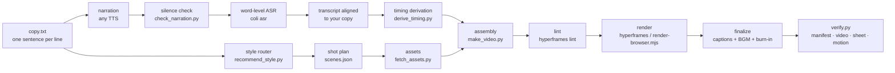

<div align="center">

# Knowledge Motion Video

**Copy in, narrated knowledge film out.**

Turn a script — or a 44,000-character report — into a narrated, captioned, 1080×1920
knowledge-animation film: semantic beats, one visual grammar chosen for the whole film and the
right layout for every sentence, real sourced photos, word-level timing, and a verification
report that **fails the build when the picture stops moving**.

[](https://github.com/xie1701/knowledge-motion-video/actions/workflows/ci.yml)
[](LICENSE)
[](https://www.python.org/)
[](https://nodejs.org/)
[](#keyless-by-default)
[](scripts/selftest.py)


<sub>All three frames are real output: two scenes of a sourced data film, one scene of the
torn-paper evidence grammar. Nothing here is a mockup.</sub>

</div>

---

## What this is

An agent skill **and** a standalone CLI for producing explainer-style vertical video from text.
It is not a template pack and not a "text to video" model — it is a production pipeline with a
contract at every step, so a film can be re-derived, diffed, and audited months later.

| | |
|---|---|
| **Input** | a plain-text script (one sentence per line), or any document you first edit down into one |
| **Output** | `renders/final.mp4` — 1080×1920, H.264 + AAC, narration + captions + optional BGM, plus `verify/report.json` |
| **Grammars** | 15 scene templates (collage ×2, sketch ×2, paper ×2, data-viz, kinetic type, comic, whiteboard, UI demo, timeline, process flow, map, cinematic) |
| **Timing** | derived from word-level ASR timestamps — never hand-written beats |
| **Assets** | keyless photo search (Openverse / Wikimedia) or Pexels / Pixabay with a free key, with relevance and "this is a paper figure" guards |
| **Cost** | no API key required to run the shipped examples end-to-end |

### What it actually solves

Knowledge video is not hard because any single step is hard. It is hard because the work is
fragmented: find assets, plan camera moves, time captions, generate media, download, assemble,
notice the timing is off, redo it. This pipeline collapses that into one recoverable contract:

- **Semantic beats, not slides.** Copy is segmented into sentences (split further at internal
  punctuation if a sentence runs past ~8s); each sentence becomes one scene, and its visuals are
  anchored to the words that are actually being spoken.
- **Routing, not one template.** The copy is analyzed for semantic signals and one visual grammar
  is chosen for the *whole film* (mixing grammars inside a film reads as a mistake, not as
  variety). `recommend_style.py` prints the decision chain, and `project.style` is validated so a
  scene can never silently drift to another grammar.
- **Renderer-neutral contracts.** `storyboard/scenes.json` is the source of truth. HyperFrames is
  the default renderer; a bundled headless-Chrome renderer (`scripts/render-browser.mjs`) is the
  fallback, so nothing here depends on a single vendor.
- **Audio-first timing.** Narration is locked first; `derive_timing.py` turns word timestamps into
  scene boundaries and template `@beats` anchors. Nothing is hand-timed.
- **Deterministic and resumable.** Fixed seeds, seek-safe motion, manifests for scenes and assets,
  and a machine-readable verification report.

## Quick start

```bash
git clone https://github.com/xie1701/knowledge-motion-video.git
cd knowledge-motion-video
npm install                      # renderer only (hyperframes + puppeteer-core)
python3 scripts/doctor.py        # checks python / node / ffmpeg / chrome

# One command: copy → style recommendation → narration → shot plan → assets →
# assembly → lint → render → captions → final mix → verify
python3 scripts/make_video.py \
    --copy examples/demo-density/script/copy.txt \
    --project /tmp/my-film --go --style data-viz \
    --narration examples/demo-density/audio/narration.mp3 \
    --transcript examples/demo-density/script/transcript.json \
    --data examples/demo-density/storyboard/data.json

python3 scripts/verify.py /tmp/my-film       # manifest · video · contact sheet · motion
```

Output lands in `/tmp/my-film/renders/final.mp4` with `verify/report.json` next to it. Drop
`--style` to see the style recommendation first; without `--go` the pipeline stops at the
confirmation gate and prints what it decided and why. Add `--bgm music.wav` for a music bed
(finalize mixes it at 0.18 and does not loop it for you — trim it to the film length first; the
showcase example ships a CC0 one at `examples/showcase-project/audio/bgm.wav`).

### Bring your own copy

```bash
# script.txt: one sentence per line, full-width punctuation, short sentences win

# ① narration + word-level timings, no API key: edge-tts emits both
python3 scripts/tts_edge.py --text-file script.txt --out-dir audio/ --prefix narration
#    → audio/narration.mp3 + audio/narration.words.json   (tokens + timestamps)
python3 scripts/check_narration.py audio/narration.mp3     # catches silently dropped lines

# ② assemble. Any TTS + any word-timing source works; `--transcript` just has to
#    carry {"tokens": [...], "timestamps": [[start, end], ...]}
python3 scripts/make_video.py --copy script.txt --project proj --go \
    --narration audio/narration.mp3 --transcript audio/narration.words.json
```

If your TTS gives you audio but no word timings, transcribe it (`coli asr -j audio.mp3 > asr.json`
for offline ASR, or any service) and then run `scripts/align_transcript.py` to line the ASR text
back up with your copy — ASR writes numbers and Latin acronyms differently (`过去十年` → `过去1年`,
`arXiv` → `Aive`), and the aligned version is what the timings should come from.

## Real runs

Three films in this repo were produced by this pipeline, and each one is committed with its full
intermediate state so you can re-render or fork it.

| Case | Input | Output | What it proves |
|---|---|---|---|
| [`examples/demo-density/`](examples/demo-density/) | 8-sentence data script + a sourced JSON | 8 scenes / 49.9s | charts carry **real, cited numbers**; the chart geometry is measured, not eyeballed |
| [`examples/showcase-project/`](examples/showcase-project/) | 32s copy | 6 scenes / 32.3s | narration + CC0 BGM + burned captions; scene boundaries and beats derived from word timestamps (±0.3s) |
| [`docs/document-to-film.md`](docs/document-to-film.md) | a 44,484-character report | 1,066-character script → **56 scenes / 319.07s** | the 42:1 rewrite, plus the TTS failure mode nobody sees |

**Document → 5-minute film.** A 3,522-line report was read as a skeleton (`grep '^#'`), edited
into a 6-act spine, and written as 32 sentences. Then the narration was generated *in five
segments* because the TTS silently dropped two long stretches (41.3s and 58.5s of pure silence,
invisible unless you look at the waveform) — the process, the budget math (3.35 characters/second
for Chinese narration, so ~1,050 characters ≈ 5 minutes) and the pitfalls are written up in
[`docs/document-to-film.md`](docs/document-to-film.md).

**Two grammars, one script (A/B).** The same 56-scene plan and the same narration rendered
through `hand-sketch` and `swiss-sketch`:

| | hand-sketch | swiss-sketch |
|---|---|---|
| grammar | paper texture, feTurbulence-wavered strokes, taped photo cards | strict modular grid, ruler-straight lines, red used only as structure |
| longest frozen frame | **0.00 s** | **0.00 s** |
| whole-film mean diff | 10.07 | 10.77 |
| layouts used | 5 (statement 22 · thesis 16 · contrast 11 · step 5 · number 2) | same, by construction |
| asset readiness | 56/56 | 56/56 |



The layout counts match because both styles are *shape-driven*: the same sentence gets the same
layout either way. That isolates what actually differs — the visual grammar, not the pacing.
Reproduce with [`scripts/compare_films.py`](scripts/compare_films.py); details and honest caveats
in [`docs/style-ab/`](docs/style-ab/).

## The 15 visual grammars

One sentence, the same narration, fifteen grammars — rendered by
[`scripts/style_sweep.py`](scripts/style_sweep.py), which is both a review tool and an
end-to-end regression net:



| Route | What it draws | Route | What it draws |
|---|---|---|---|
| `data-viz` | sourced charts, 5 honest layouts, big numbers | `hand-sketch` | line art drawn by a pen, paper texture |
| `swiss-sketch` | the same shapes on a strict modular grid | `collage-evidence` | torn-paper evidence wall of real photos |
| `editorial-collage` | magazine collage, main + secondary photo | `generated-cinematic` | graded cinematic still (photos only) |
| `kinetic-typography` | type as the subject, line-by-line | `whiteboard-tutorial` | marker on whiteboard |
| `process-flow` | steps, arrows, pipeline states | `timeline-history` | a dated axis with events |
| `map-geo` | abstract map + located points | `ui-demo` | screen recording look, cursor, callouts |
| `paper-diorama` | layered paper cut-outs | `paper-fold` | folded paper panels |
| `character-concept-comic` | a character acting out the idea | | |

```bash
python3 scripts/style_sweep.py --copy excerpt.txt --narration excerpt.m4a \
    --transcript excerpt.json --out-dir q/
# → q/sweep-contact-sheet.jpg   5×3 frame grid
#   q/sweep-grid.mp4            15 cells side by side
#   q/sweep-report.json         per-style duration / layout / motion / failure reason
```

Live motion, from the showcase film:


## How it works



Every arrow is a file you can read: `storyboard/{scenes,beats,layouts,assets-plan,style-decision}.json`,
`assets/media/manifest.json`, `captions/captions.ass`, `verify/report.json`.

**Templates are declarative.** A scene template is an HTML fragment with slots (`{{TITLE}}`,
`{{BARS}}`, …) plus a trailing `// @beats enter=… build=… reveal=… mid=… peak=… settle=…`
annotation. At assembly time the engine solves those anchors against the narration's word
timestamps and re-times the template's GSAP timeline segment-wise, so "the bars grow when the
number is spoken" is a property of the template, not of a hand-tuned project. The same mechanism
gives each scene a `mid` development beat, so a scene changes *state* halfway instead of just
finishing its entrance and freezing.

## Quality gates

The point of a pipeline is what it refuses to ship.

- **Motion is a gate, not a taste.** `verify.py` samples the master at 8 fps and compares every
  frame **to the same frame one second earlier** (`blend=difference` + `signalstats`) — the scale
  at which a slow drift reads as visible while a genuine hold still measures zero. It fails on any
  run of **more than 1.2 s with no change at all**, or a whole-film mean below 0.4. The first run
  of this gate failed both shipped films (1.75 s and 1.50 s of literally identical pixels, 24–27%
  of samples under the floor); the fix was an engine-level ambient layer plus a second development
  beat, not a shorter threshold.
- **Charts must be honest.** Bars are zero-baseline and linear (`h = 82%·v/vmax`), the axis is
  uniformly filled, category labels sit below the baseline, and a scene with no numbers gets a
  big-type statement instead of a fake bar. Every chart prints its source; if there is no source,
  none is printed.
- **Numbers are traceable.** The data film's figures come from Stanford HAI AI Index 2025/2026,
  arXiv's annual reports, NeurIPS 2019, AAAI 2025 and arXiv 2603.23640 — collected in
  [`examples/demo-density/data-sources-research.md`](examples/demo-density/data-sources-research.md),
  including the items where **no verifiable source was found**.
- **Captions are constrained by geometry.** Lines are re-chunked to fit the safe width, never split
  mid-word, and the band is kept clear of the bottom 230 px.
- **Narration is checked for silence.** TTS drops lines silently; a >3 s gap aborts loudly instead
  of producing a mis-timed film.
- **The engine self-tests without rendering.** `python3 scripts/selftest.py` runs **204 structural
  assertions** (template parsing, anchor completeness, injected ambient attributes, variant rules,
  slot contracts, `node --check` on every extracted scene script, retimer regressions) in about a
  second, with no network and no browser.

## Install

**As a CLI:** clone and run the scripts. Python standard library only; `npm install` is needed just
for the renderer.

**As an agent skill:**

```bash
./install.sh     # symlinks into ~/.cola/skills/knowledge-motion-video
```

[`SKILL.md`](SKILL.md) is the agent-facing workflow — the decisions, the gates, and the failure
modes an agent is expected to handle. Point any coding agent at it (or at
[`docs/`](docs/)) and it can drive the pipeline; the CLI works the same either way.

## Requirements

| | |
|---|---|
| Python | 3.10+ (standard library only) |
| Node.js | 22+ (`npm install` pulls `hyperframes` + `puppeteer-core`) |
| FFmpeg | `ffmpeg` + `ffprobe` on `PATH` |
| Browser | Chrome / Chromium / Edge for the fallback renderer |
| Optional | `coli` (offline ASR), `edge-tts` (free narration), `PEXELS_API_KEY` / `PIXABAY_API_KEY` (better photos) |

## Keyless by default

The shipped examples run with no API key: narration comes from a committed MP3, photos come from
Openverse / Wikimedia, BGM is CC0. Text-to-video is deliberately **not** wired in — the only
permissively-licensed backend considered was Wan2.2 (Apache-2.0), and the cleanest option was to
let you use real photos instead of generating footage you cannot license.

## Honest limits

- **Keyless photo relevance is roughly 3-in-4.** View `assets/media/contact-sheet.jpg` before
  rendering (or add a key) and fix the off-topic slot by editing its query. The pipeline refuses
  paper figures, flowcharts and screenshots, but a dark-background paper figure can still slip
  through.
- **Four of the fifteen templates still fail the motion gate in their opening scene**
  (`kinetic-typography`, `map-geo`, `process-flow`, `timeline-history`). `make_video.py` treats
  motion as a warning, not a hard failure, for exactly this reason — `--strict-motion` flips it.
- **Silent TTS line drops are real.** Segment your narration and check it; see
  [`docs/document-to-film.md`](docs/document-to-film.md).
- **Style is not a "less stiff" switch.** Pacing comes from the arrangement (entrance + mid-scene
  state change + ambient layer) and from whether the layout changes per sentence. Two styles can be
  equally alive.

## Repository layout

```text
SKILL.md                  the agent-facing workflow
references/               pipeline, scene schema, style router, motion language, stack notes
scripts/                  19 tools: scaffold, validate, recommend, assemble, render, captions,
                          finalize, verify, fetch-assets, sweep, compare, self-test, doctor
assets/templates/scenes/  the 15 scene grammars (+ series furniture)
assets/styles/            4 design token presets
assets/lexicon/           word list + Chinese→English visual concept table
examples/                 complete runnable projects, renders and verify reports included
docs/                     case studies, style sweeps, A/B comparison, hero art
```

## Docs

| | |
|---|---|
| [`SKILL.md`](SKILL.md) | the full workflow an agent follows |
| [`docs/document-to-film.md`](docs/document-to-film.md) | turning a long document into a film, budget math and pitfalls |
| [`docs/style-recommendation.md`](docs/style-recommendation.md) | how the semantic router decides |
| [`docs/style-sweep/`](docs/style-sweep/) | all 15 grammars on one sentence, with per-style notes |
| [`docs/style-ab/`](docs/style-ab/) | hand-sketch vs swiss-sketch, same script |
| [`references/scene-schema.md`](references/scene-schema.md) | the `scenes.json` contract |
| [`CHANGELOG.md`](CHANGELOG.md) | what changed in each version, including the bugs worth remembering |

## 中文速览

一句话：**给一段文案，出一支有旁白、有字幕、有素材、时间轴卡在字上的竖屏知识动画。**

```bash
git clone https://github.com/xie1701/knowledge-motion-video.git && cd knowledge-motion-video
npm install && python3 scripts/doctor.py
python3 scripts/make_video.py --copy 你的文案.txt --project /tmp/片 --go \
    --narration 旁白.mp3 --transcript 词级转写.json
python3 scripts/verify.py /tmp/片        # 成片 + 验证报告
```

- **15 种视觉语法**（拼贴、手绘、瑞士网格、数据图、动态字、漫画、纸雕、折纸、白板、
  UI 演示、时间线、流程图、地图、电影感…），整片只走一条——混着用像失误，不像丰富。
- **时间轴全部由词级 ASR 推导**，模板里的 `@beats` 锚点挂到念到那个字的时刻，不用手写 beat。
- **质量门禁会拦你**：画面停住超过 1.2s 直接判不合格；图表必须零基线、标来源、没数据就不画柱。
- 真案例与坑：[`docs/document-to-film.md`](docs/document-to-film.md)（4.4 万字 → 5:19 片子，
  含 TTS 静默丢句）、[`docs/style-ab/`](docs/style-ab/)（同一份文案两条风格并排）。
- 环境：Python 3.10+ / Node 22+ / FFmpeg；**跑通示例不需要任何 API key**。

## License

MIT — see [LICENSE](LICENSE). Third-party components keep their own terms, and the ones that
matter are listed in [THIRD-PARTY-NOTICES.md](THIRD-PARTY-NOTICES.md):

- **GSAP** is vendored (`composition/vendor/gsap.min.js`) under the GreenSock Standard License —
  free for general use, restricted if you are building a competing visual animation builder.
- **HyperFrames** (the optional default renderer) is Apache-2.0; **FFmpeg** is LGPL/GPL depending
  on the build.
- `assets/lexicon/zh-words.txt` is derived from jieba's `dict.txt` (MIT, © 2013 Sun Junyi),
  trimmed and extended with project-authored vocabulary; provenance is in the file header.

Anything you fetch, generate, or import with this pipeline is governed by its own license — the
asset fetcher records provenance in `assets/media/manifest.json` so you can publish an attribution
list. Credit the source of every photo and dataset you ship.

## Credits and provenance

Built as an original engine. The *ideas* were learned from the explainer craft — Vox-style
collage, Kurzgesagt-style structure, and creator workflows such as the "badcat-animate" demo that
started this project — but no protected frames, characters, artwork, or code are reproduced here;
every template, script and asset in this repository is written for it. The licence review behind
the dependency choices is in [`references/open-source-stack.md`](references/open-source-stack.md).
